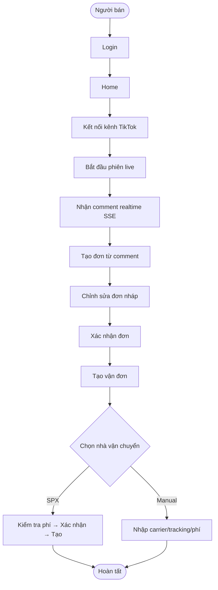
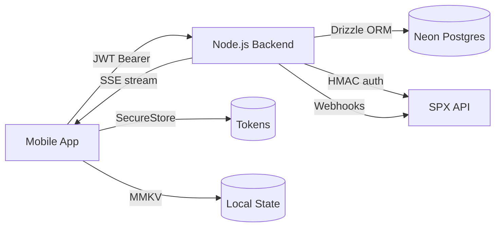

# Lumi Mobile App — Flow Documentation

> Generated from source code analysis. Last updated: 2026-07-10.
> Based on: Expo SDK 56, Expo Router, Zustand + MMKV, Axios + SSE.

## Cấu trúc tài liệu

| File | Nội dung |
|------|----------|
| [app-navigation-flow.md](./app-navigation-flow.md) | Toàn bộ màn hình và cấu trúc navigation |
| [auth-flow.md](./auth-flow.md) | Login, register, logout, token refresh, license |
| [live-comment-flow.md](./live-comment-flow.md) | SSE, comment feed, TikTok live session |
| [order-flow.md](./order-flow.md) | Tạo đơn từ comment, quản lý đơn, xác nhận |
| [address-flow.md](./address-flow.md) | Chọn / thêm / sửa địa chỉ khi tạo vận đơn |
| [shipment-flow.md](./shipment-flow.md) | Tạo vận đơn SPX và Manual |
| [report-flow.md](./report-flow.md) | Màn Báo Cáo, filter, chart |
| [api-data-flow.md](./api-data-flow.md) | HTTP client, token, interceptor, SSE |
| [error-state-flow.md](./error-state-flow.md) | Loading / empty / error patterns |

---

## App Overview Flow

```mermaid
flowchart TD
  A([Mở App]) --> B[Splash Screen]
  B --> C{Token tồn tại?}
  C -->|Không| D{Onboarding done?}
  D -->|Chưa| E[/onboarding]
  D -->|Rồi| F[/(auth)]
  E --> F
  F --> G[Login / Register]
  G -->|Thành công| H{canUseApp?}
  C -->|Có| I[getMeBootstrap API]
  I -->|OK| H
  I -->|Lỗi 401| F
  H -->|false| J[/license-expired]
  H -->|true| K[/(tabs) Home]
  J -->|Đăng xuất| F
```

---

## Tab Navigation Overview

```mermaid
flowchart LR
  K[/(tabs)] --> T1[🏠 Home]
  K --> T2[👥 Customers]
  K --> T3[📋 History]
  K --> T4[🚚 Shipping]
  K --> T5[📊 Reports]
  K --> T6[⚙️ Settings]

  T1 --> OD[/order-detail]
  T4 --> SD[/shipping-detail/id]
  T3 --> LS[/live-session-detail]
  OD --> CS[/order-detail/create-shipment]
  CS --> AP[address-picker]
  CS --> AF[address-form]
  CS --> SS[success]
  T6 --> ST1[/manage-tiktok-channel]
  T6 --> ST2[/printer-settings]
  T6 --> ST3[/shipping-settings]
  T6 --> ST4[/license-plans]
```

---

## User Journey Flow (điển hình)



---

## Data Flow Overview


