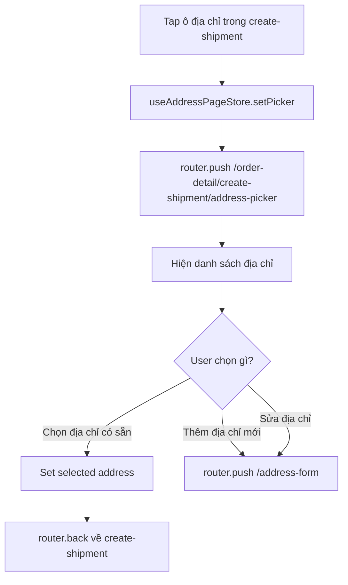
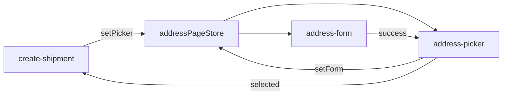

# Address Flow

> Files: `src/features/orders/screens/create-shipment-address-picker.tsx`, `create-shipment-address-form.tsx`
> Store: `src/features/orders/stores/address-page-store.ts`
> Geo: `src/features/settings/service/vn-geo.ts`

## Tổng quan

Address flow được dùng trong luồng tạo vận đơn (`/order-detail/create-shipment`). Có 2 loại địa chỉ:

| Loại | Nguồn dữ liệu | API |
|------|-------------|-----|
| Người gửi (shop) | `useShippingSettings` | `GET /shop/addresses` |
| Người nhận (customer) | `useCreateShipment` | `GET /customers/:id/addresses` |

## Address Page Store (`useAddressPageStore`)

Store ephemeral (không persist) dùng để truyền config giữa các sub-screen:

```
setPicker({ type: 'sender'|'recipient', currentAddressId })
setForm({ type, addressId?, prefill? })
```

## Chọn địa chỉ (Picker)



## Thêm / Sửa địa chỉ (Form)

```mermaid
flowchart TD
  H[/address-form] --> I[Hiện form: tên, SĐT, tỉnh/huyện/xã, số nhà]
  I --> J[Chọn tỉnh → load huyện → load xã bằng vn-geo.ts]
  J --> K{Loại địa chỉ?}
  K -->|Sender — shop address| L[PATCH /shop/addresses/:id hoặc POST]
  K -->|Recipient — customer address| M[PATCH /customers/:id/addresses/:addrId hoặc POST]
  L -->|OK| N[router.back về picker]
  M -->|OK| N
  L -->|Error| O[Toast error, giữ form]
  M -->|Error| O
```

## Xóa địa chỉ

- Swipe to delete hoặc button xóa trong picker
- Confirm dialog → DELETE API → remove khỏi list

## Vietnam Geo Picker

`vn-geo.ts` cung cấp static data hoặc API call để lấy:
- Tỉnh / Thành phố (63 tỉnh)
- Quận / Huyện (phụ thuộc tỉnh đã chọn)
- Phường / Xã (phụ thuộc huyện đã chọn)

Picker component: `src/components/geo-picker/`

## State Flow



## Error/Empty States

| Tình huống | Xử lý |
|-----------|-------|
| Chưa có địa chỉ | "Thêm địa chỉ" prompt |
| Load địa chỉ lỗi | ErrorState + retry |
| Form validation fail | React Hook Form + Zod inline errors |
| Submit lỗi | Toast error |

## Assumptions / Cần kiểm tra

- `useAddressPageStore` là ephemeral — nếu app bị crash giữa chừng, config bị mất và user phải bắt đầu lại từ create-shipment.
- Không thấy search/filter trong address picker — khi shop có nhiều địa chỉ pickup, UX có thể khó dùng.
- Geo data (`vn-geo.ts`) cần verify là static bundle hay fetch từ API — nếu static, cần cập nhật khi VN thay đổi đơn vị hành chính.
