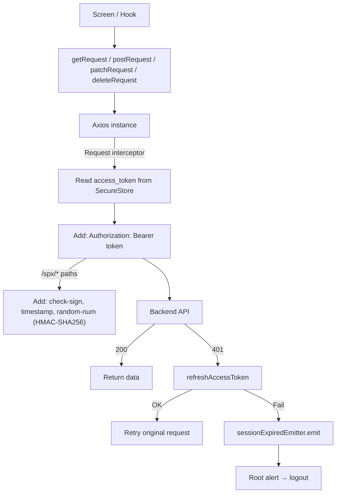
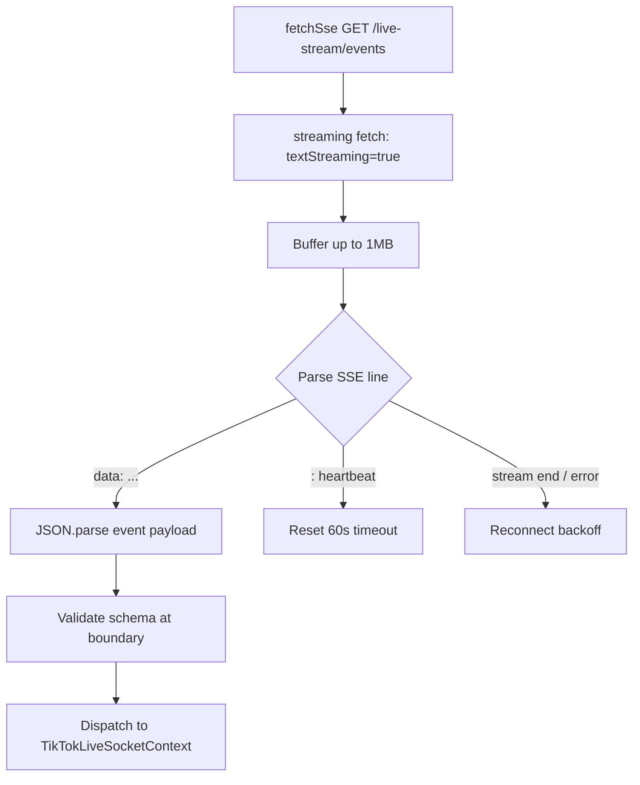
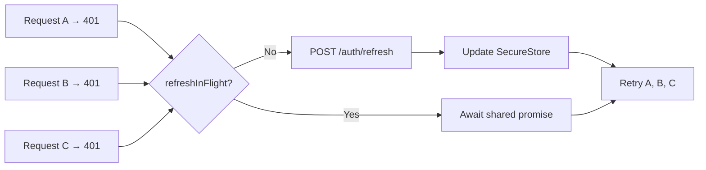

# API & Data Flow

> Files: `src/utils/http/axios.ts`, `src/utils/http/auth-session.ts`, `src/utils/http/fetch-sse.ts`
> Config: `src/constants/config.ts` (`EXPO_PUBLIC_SUPABASE_URL_ENDPOINT`)

## HTTP Client Architecture



## Request Helpers

| Helper | HTTP Method | Mô tả |
|--------|------------|-------|
| `getRequest(path, params?)` | GET | Fetch data |
| `postRequest(path, body?)` | POST | Create / action |
| `patchRequest(path, body?)` | PATCH | Update partial |
| `deleteRequest(path)` | DELETE | Remove |

Không dùng `fetch` hay Axios trực tiếp trong screens — luôn qua helpers.

## SPX Request Signing

Chỉ áp dụng cho paths bắt đầu bằng `/spx/`:

```
Payload string = stringify(request body)
check-sign = HMAC-SHA256(SPX_APP_SECRET, "{appId}_{timestamp}_{randomNum}_{payloadString}")
```

Headers được inject tự động bởi Axios request interceptor — không cần thêm thủ công.

## SSE Data Flow



## Token Refresh Deduplication



## Config

| Env var | Dùng cho | Public? |
|---------|---------|---------|
| `EXPO_PUBLIC_SUPABASE_URL_ENDPOINT` | Backend base URL | Yes (public) |
| `SPX_APP_SECRET` | HMAC signing | No — server-side only |

`EXPO_PUBLIC_*` vars có thể đọc từ client bundle — không chứa secrets.

## Error Handling Strategy

| Loại lỗi | Xử lý |
|---------|-------|
| Network error | Throw `NetworkError`, screen show retry |
| 400 Bad Request | Throw với error message từ body |
| 401 Unauthorized | Auto-refresh → retry; nếu fail → session expired |
| 403 Forbidden | Throw `ForbiddenError` |
| 404 Not Found | Throw `NotFoundError` |
| 422 Validation | Throw với field errors |
| 5xx Server Error | Throw `ServerError`, screen show generic error |

## Assumptions / Cần kiểm tra

- Base URL được đặt tên `EXPO_PUBLIC_SUPABASE_URL_ENDPOINT` — tên legacy từ khi dùng Supabase, nên đổi thành `EXPO_PUBLIC_API_BASE_URL` để rõ nghĩa hơn.
- Không thấy request timeout config trong Axios instance — nên set mặc định 30s để tránh request treo vô hạn.
- Không thấy global retry config cho non-401 errors (network flaky) — hiện tại screen tự implement retry button.
