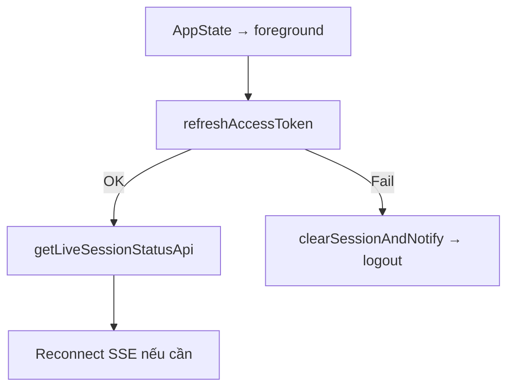

# Auth Flow

> Files: `src/features/auth/`, `src/utils/http/axios.ts`, `src/utils/http/auth-session.ts`, `src/utils/http/session-event.ts`

## Token Storage

| Layer | Key | Dữ liệu |
|-------|-----|---------|
| `expo-secure-store` | `"access_token"` | JWT access token |
| `expo-secure-store` | `"refresh_token"` | JWT refresh token |
| MMKV (Zustand persist) | `"tiktok-live-auth-storage"` | `user`, `isRemembered`, `lastUsername` |

Tokens **không bao giờ** nằm trong Zustand, MMKV, AsyncStorage, log, hay response trả về client.

## Bootstrap Flow

```mermaid
flowchart TD
  A([App Mount]) --> B[Wait MMKV hydration]
  B --> C{access_token trong SecureStore?}
  C -->|Không| D[user = null → redirect /(auth)]
  C -->|Có| E[getMeBootstrapApi GET /me/bootstrap]
  E -->|200 OK| F[setUserFromBootstrap → canUseApp check]
  F -->|canUseApp=false| G[redirect /license-expired]
  F -->|canUseApp=true| H[redirect /(tabs)]
  E -->|401| I[refreshAccessToken]
  I -->|OK| E
  I -->|Fail| D
  E -->|Network error| J[Show error, retry or logout]
```

## Login Flow

```mermaid
flowchart TD
  L1[User nhập email + password] --> L2[POST /auth/login]
  L2 -->|Success| L3[Extract access_token + refresh_token]
  L3 --> L4[secureStorage.setAccessToken + setRefreshToken]
  L4 --> L5[setLoginState Zustand]
  L5 --> L6[bootstrapAuth → GET /me/bootstrap]
  L6 --> L7[redirect /(tabs)]
  L2 -->|Error 401/400| L8[Hiện lỗi, giữ màn login]
```

## Register Flow

Register đi cùng flow với Login sau khi tạo tài khoản:

```
POST /auth/register → extract tokens → setLoginState → bootstrap → /(tabs)
```

## Logout Flow

```mermaid
flowchart TD
  O1([User nhấn Đăng xuất]) --> O2[secureStorage.clearAuth]
  O2 --> O3[Zustand: set user = null]
  O3 --> O4[resetBootstrapGuard]
  O4 --> O5[router.replace /(auth)]
```

## Token Refresh Flow

```mermaid
flowchart TD
  R1[HTTP request → 401] --> R2{refreshInFlight?}
  R2 -->|Có| R3[Đợi promise chung]
  R2 -->|Không| R4[POST /auth/refresh với refresh_token]
  R4 -->|OK| R5[Cập nhật SecureStore cả 2 token]
  R5 --> R6[Retry request gốc]
  R6 -->|OK| R7[Response trả về]
  R4 -->|Fail| R8[clearSessionAndNotify]
  R8 --> R9[sessionExpiredEmitter.emit]
  R9 --> R10[Alert ở root _layout.tsx]
  R10 --> R11[logout → /(auth)]
```

Deduplication: concurrent 401s dùng chung một promise — chỉ gọi `/auth/refresh` đúng một lần.

## Session Expired (Background Mode)



## License / canUseApp Check

`user.canUseApp` được trả về từ `/me/bootstrap`. Được check ở:
- `src/app/index.tsx` — redirect `/license-expired` nếu false
- `src/app/(auth)/_layout.tsx` — guard thêm
- `src/app/(tabs)/_layout.tsx` — guard trên tab group

```mermaid
flowchart TD
  C1[Bootstrap OK] --> C2{user.canUseApp?}
  C2 -->|true| C3[Vào app bình thường]
  C2 -->|false| C4[/license-expired]
  C4 --> C5[Chỉ 1 nút: Đăng xuất]
  C5 --> C6[logout → /(auth)]
```

## HTTP Client (`src/utils/http/axios.ts`)

- Request interceptor: đọc `access_token` từ SecureStore, thêm `Authorization: Bearer`
- 401 interceptor: retry once sau refresh
- SPX paths (`/spx/*`): thêm HMAC-SHA256 headers (`check-sign`, `timestamp`, `random-num`)

## Assumptions / Cần kiểm tra

- `POST /auth/logout` tồn tại trong API service nhưng không thấy gọi từ `logout()` hook — có thể là backend invalidate token server-side chưa implement hoặc fire-and-forget.
- Không thấy "Quên mật khẩu" / forgot password flow trong code hiện tại.
- `isRemembered` lưu trong Zustand nhưng không thấy logic ảnh hưởng đến auto-login hay token TTL.
