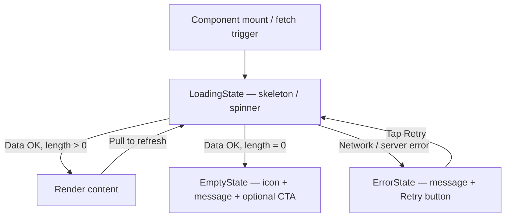
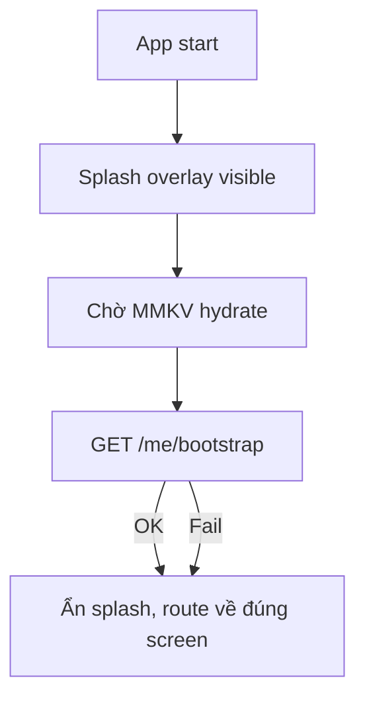

# Error & Loading State Flow

> Pattern dùng toàn app: `LoadingState`, `ErrorState`, `EmptyState` components
> Files: `src/components/loading-state/`, `src/components/error-state/`, `src/components/empty-state/`

## Ba trạng thái chuẩn

Mọi màn hình load async đều phân biệt 3 trạng thái:



## Loading Patterns

| Pattern | Dùng khi |
|---------|---------|
| Skeleton list | Màn hình list đầu tiên load |
| Spinner overlay | Submit form, đang xử lý action |
| Inline skeleton | Row trong FlatList chờ data |
| Tab loading indicator | Chuyển tab, load nhẹ |

## Error Patterns

```mermaid
flowchart TD
  E1{Loại lỗi?} -->|Network offline| E2[Toast "Không có kết nối mạng"]
  E1 -->|401 — session expired| E3[Root alert → logout]
  E1 -->|403 — forbidden| E4[Toast "Không có quyền"]
  E1 -->|404 — not found| E5[Navigate back + toast]
  E1 -->|Form validation| E6[Inline field errors — React Hook Form]
  E1 -->|Server 5xx| E7[ErrorState full screen + Retry]
  E1 -->|Action fail toast| E8[Toast error, giữ nguyên state]
```

## Empty State Patterns

| Màn hình | Trigger | Message |
|---------|---------|---------|
| Orders list | Không có đơn | "Chưa có đơn hàng" |
| Customers list | Không có khách | "Chưa có khách hàng" |
| Shipping list | Không có vận đơn | "Chưa có vận đơn" |
| Address picker | Không có địa chỉ | "Thêm địa chỉ mới" + CTA |
| Reports | Không có data | "Chưa có doanh thu trong kỳ này" |
| History | Không có phiên | "Chưa có phiên live nào" |
| Live comments | Live chưa bắt đầu | Placeholder connect UI |

## Toast System

Toast được dùng cho:
- Action success nhẹ: "Đã tạo đơn", "Đã cập nhật"
- Error nhẹ: "Tạo vận đơn thất bại"
- Warning: "Vui lòng điền đầy đủ thông tin"

Toast **không** dùng cho:
- Session expired (dùng Alert tại root `_layout.tsx`)
- Critical error cần user action (dùng ErrorState)

## Session Expired Flow

```mermaid
flowchart TD
  SE1[refreshAccessToken thất bại] --> SE2[clearSessionAndNotify]
  SE2 --> SE3[sessionExpiredEmitter.emit]
  SE3 --> SE4[_layout.tsx listener]
  SE4 --> SE5["Alert: Phiên đăng nhập đã hết hạn"]
  SE5 --> SE6[logout → /(auth)]
```

Chỉ một Alert duy nhất hiện tại root — feature screens không hiện Alert session expired.

## Splash / Bootstrap Loading



Splash overlay được điều khiển bởi `src/app/_layout.tsx` — không bị flash do route guard.

## Assumptions / Cần kiểm tra

- Không thấy global offline detection (NetInfo) — network error hiện chỉ được phát hiện khi request fail.
- Retry button trong ErrorState gọi lại fetch function của hook — cần đảm bảo không bị stale closure.
- Toast tự dismiss sau N giây — không thấy config global duration trong codebase.
