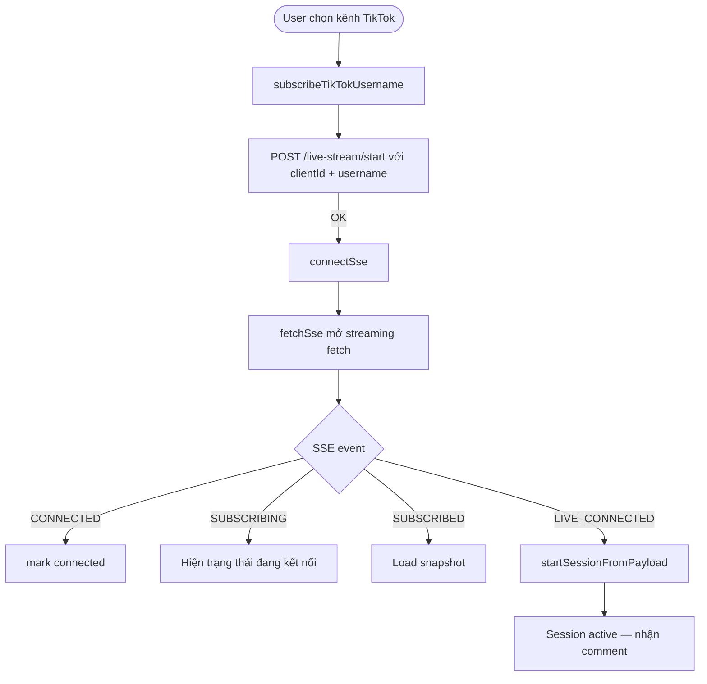
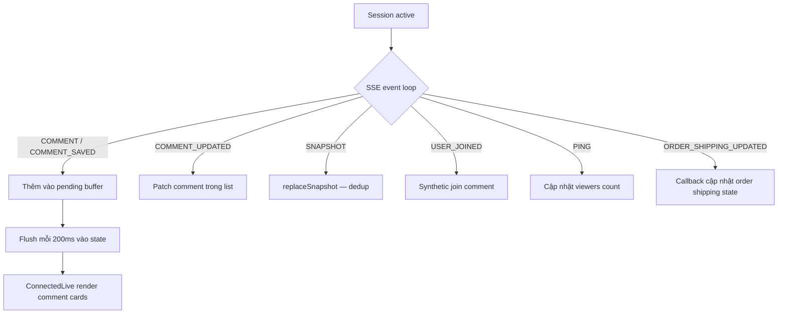
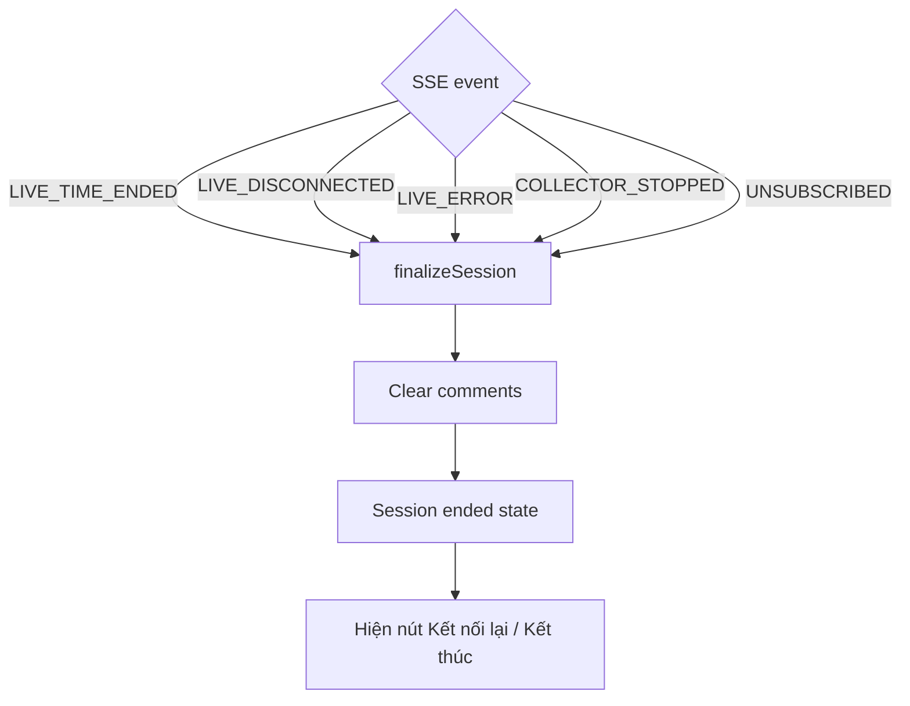
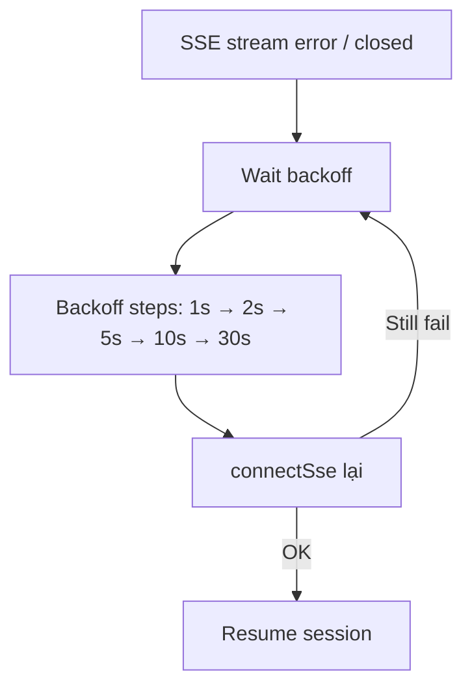
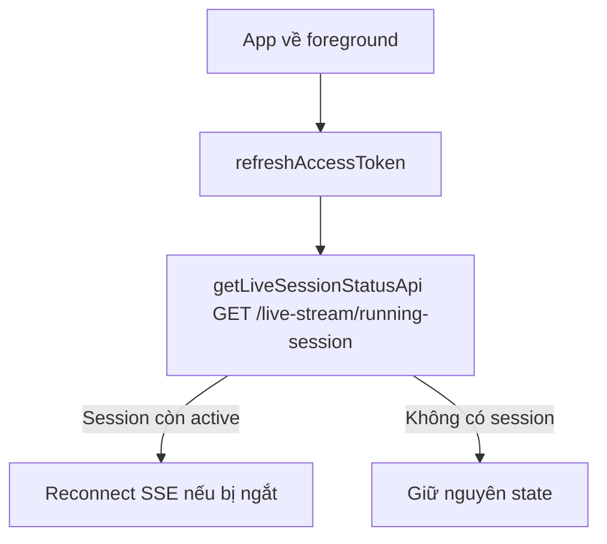

# Live Comment Flow

> Files: `src/features/tiktok-live/`, `src/utils/http/fetch-sse.ts`, `src/utils/http/session-event.ts`
> Provider: `TikTokLiveSocketProvider` — root level, never unmounted.

## SSE Architecture

```
Backend SSE endpoint: GET /live-stream/events?clientId=...
  ↓
fetchSse() — streaming fetch, React Native textStreaming
  ↓
TikTokLiveSocketProvider (root context)
  ├── TikTokLiveSocketContext  — stable state + actions
  └── TikTokLiveTimerContext   — liveDurationSeconds (high-frequency updates)
```

Comment batching: pending buffer flushed mỗi 200ms bằng `setInterval`.

## Connect & Start Live



## Comment Realtime Flow



## Disconnect / End Live



## Reconnect (Exponential Backoff)



## AppState Foreground Resume



## SSE Events Handled

| Event | Hành động |
|-------|-----------|
| `CONNECTED` | Mark connected |
| `PING` | Update viewers count |
| `SUBSCRIBING` | Show connecting state |
| `SUBSCRIBED` | Load snapshot |
| `LIVE_CONNECTED` | `startSessionFromPayload()` |
| `LIVE_TIME_STARTED` | Start timer |
| `LIVE_TIME_STATUS` | Update timer |
| `LIVE_TIME_ENDED` | Finalize session |
| `LIVE_DISCONNECTED` | Finalize session |
| `LIVE_ERROR` | Finalize session |
| `COLLECTOR_STOPPED` | Finalize session |
| `COMMENT` | Add to pending buffer |
| `COMMENT_SAVED` | Add to pending buffer |
| `COMMENT_UPDATED` | Patch in list |
| `SNAPSHOT` | Replace snapshot (dedup) |
| `USER_JOINED` | Synthetic join comment |
| `UNSUBSCRIBED` | Finalize session |
| `ORDER_SHIPPING_UPDATED` | Callback to order state |

## fetchSse Details

- File: `src/utils/http/fetch-sse.ts`
- Dùng `reactNative: { textStreaming: true }` — không dùng WebSocket hay EventSource
- Buffer cap: 1MB
- Heartbeat timeout: 60s — nếu không có data → cancel reader
- AbortSignal support cho clean teardown
- Xử lý `AbortError` và `FetchRequestCanceledException` im lặng

## Resume Username

Username cuối cùng kết nối được persist vào MMKV key `"lumi_live_resume_username"`. Khi mở lại app, UI tự điền lại username để user dễ reconnect.

## Assumptions / Cần kiểm tra

- Facebook tab trên Home PagerView hiện là "coming soon" — chưa có logic SSE cho Facebook.
- `fetchSse` dùng streaming fetch không chuẩn EventSource — cần test kỹ trên Android (một số thiết bị cũ có vấn đề với text streaming).
- Comment dedup khi `SNAPSHOT` được handle bằng `replaceSnapshot()` — cần verify logic dedup không bỏ sót comment khi snapshot overlap với pending buffer.
