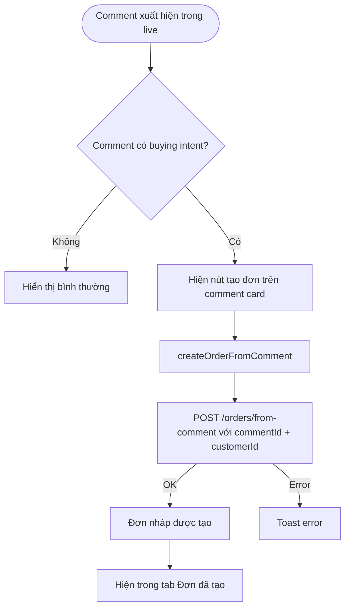
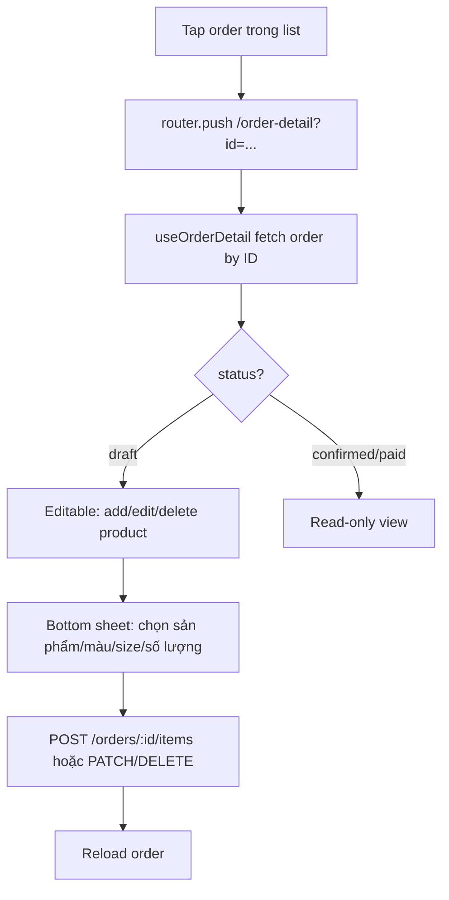
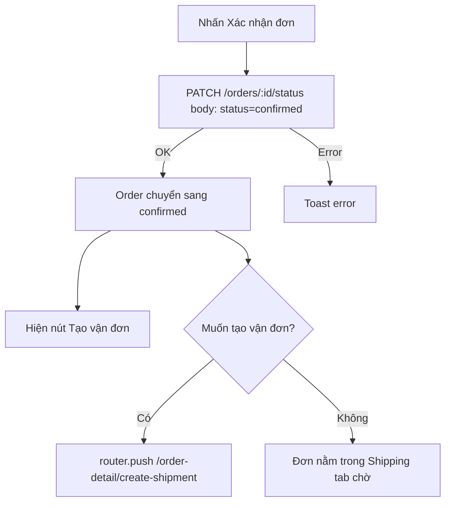
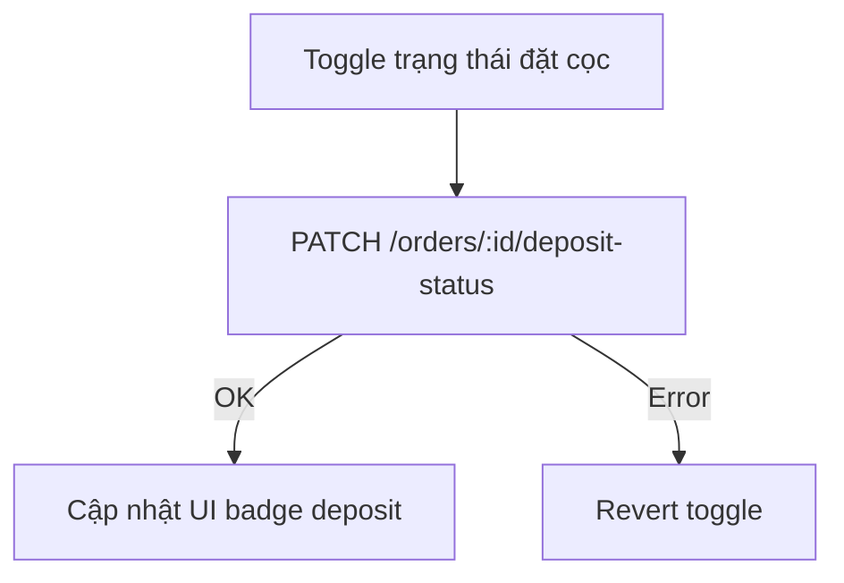

# Order Flow

> Files: `src/features/orders/`, `src/features/orders/hooks/use-order-manager.ts`, `src/features/orders/hooks/use-order-detail.ts`
> API: `src/features/orders/service/api.ts`

## Tạo đơn từ comment



## Order Manager State (`use-order-manager.ts`)

```
orders (raw list từ API)
  ├── draftOrders      — status=draft
  ├── confirmedOrders  — status=confirmed
  ├── paidOrders       — status=paid
  ├── customers        — merge từ comments + orders
  ├── filteredOrders   — sau filter + search
  ├── buyingCount      — số comment có intent
  └── totalRevenue     — tổng doanh thu confirmed/paid
```

## Xem và sửa đơn (`/order-detail`)



## Xác nhận đơn



## Deposit / COD



## Filter & Search

- Filter tabs: "Tất cả", "Nháp", "Xác nhận", "Đã giao"
- Search: theo tên khách hàng hoặc mã đơn
- State lưu trong `useOrderManager` — không persist, reset khi reload

## Order Data Model (từ types)

```
OrderWithTikTok {
  id, status, createdAt, updatedAt
  customer: CustomerSummary
  items: OrderProduct[]
  subtotal, shipping, discount, deposit, total, cod
  note
  shipment?: ShipmentInfo
}
```

## Error/Empty States

| Tình huống | Xử lý |
|-----------|-------|
| Không có đơn | `EmptyState` component |
| Load lỗi | `ErrorState` component + retry button |
| Thêm sản phẩm lỗi | Toast error, item không được thêm |
| Xác nhận lỗi | Toast error, status không đổi |
| Xóa đơn | Confirm dialog → DELETE /orders/:id → remove khỏi list |

## Assumptions / Cần kiểm tra

- `use-order-detail.ts` fetch toàn bộ order list rồi find by ID — nên có endpoint `GET /orders/:id` riêng để tối ưu.
- Không thấy realtime sync đơn khi nhiều thiết bị cùng mở — refresh thủ công hoặc pull-to-refresh.
- `totalRevenue` tính client-side từ confirmed+paid orders — nên dùng server-side aggregate để tránh inconsistency khi có nhiều đơn.
