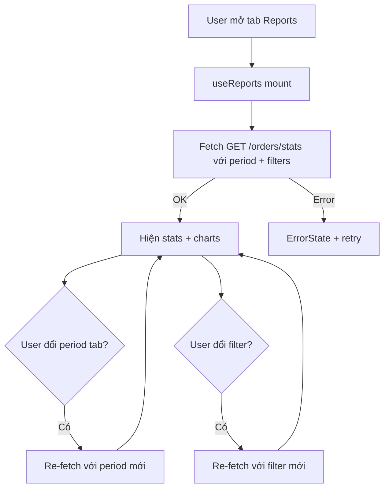
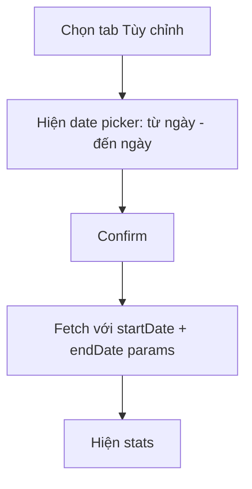

# Report Flow

> Files: `src/features/reports/hooks/use-reports.ts`, `src/features/reports/service/api.ts`
> Route: `/(tabs)/reports`

## Tổng quan

Reports tab hiển thị thống kê doanh thu và đơn hàng theo khoảng thời gian. Dữ liệu fetch từ `GET /orders/stats`.

## Fetch Flow



## Period Selector

| Tab | Value | Mô tả |
|-----|-------|-------|
| Hôm nay | `1d` | Ngày hiện tại |
| 7 ngày | `7d` | 7 ngày gần nhất |
| 1 tháng | `1m` | 30 ngày |
| 6 tháng | `6m` | 180 ngày |
| 1 năm | `1y` | 365 ngày |
| Tùy chỉnh | `custom` | Date picker range |

## Filters

- Deposit status: all / deposited / not-deposited
- Order status: all / confirmed / paid / draft

## Response Model (từ `GET /orders/stats`)

```
OrderStats {
  totalRevenue: number       — tổng doanh thu
  totalOrders: number        — tổng số đơn
  confirmedOrders: number    — đơn xác nhận
  paidOrders: number         — đơn đã thanh toán
  depositTotal: number       — tổng đặt cọc
  codTotal: number           — tổng COD
  chartData: ChartPoint[]    — dữ liệu vẽ chart theo ngày
}
```

## Chart

- Library: `react-native-gifted-charts`
- Loại: Bar chart (doanh thu theo ngày) + Line chart (số đơn)
- Data: `chartData[]` từ API — không tính client-side

## Custom Date Range



## Error/Empty States

| Tình huống | Xử lý |
|-----------|-------|
| Không có dữ liệu | EmptyState "Chưa có doanh thu" |
| Load lỗi | ErrorState + retry |
| Network offline | ErrorState + retry |

## Assumptions / Cần kiểm tra

- `totalRevenue` do server tổng hợp — không tính client-side, tránh inconsistency.
- Không thấy export CSV / PDF trong code hiện tại.
- Không thấy compare period (kỳ này vs kỳ trước).
