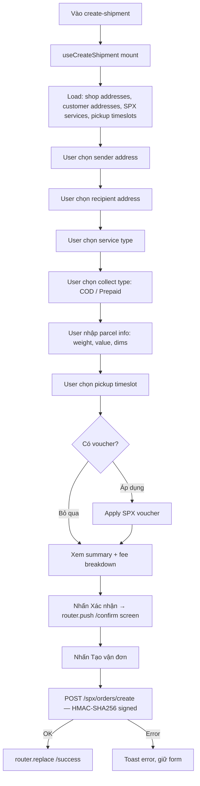
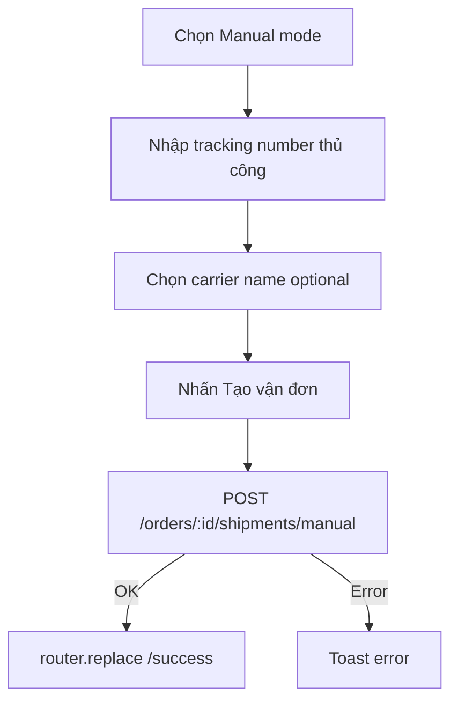
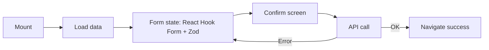

# Shipment Flow

> Files: `src/features/orders/hooks/use-create-shipment.ts`, `src/features/orders/service/create-shipment-api.ts`
> SPX auth: `src/utils/http/axios.ts` (HMAC-SHA256 interceptor)
> Routes: `/order-detail/create-shipment`, `/success`

## Provider Modes

| Mode | Kích hoạt | Backend path |
|------|-----------|-------------|
| Manual | Luôn hiện | `POST /orders/:id/shipments/manual` |
| SPX | Shop đã kết nối SPX token | `POST /orders/:id/shipments/spx` |
| GHN/GHTK/VTP | Coming soon | — |

## SPX Shipment Flow



## Manual Shipment Flow



## SPX HMAC-SHA256 Auth

Mọi request đến `/spx/*` được Axios interceptor ký tự động:

```
check-sign = HMAC-SHA256(key=SPX_TOKEN, data="{appId}_{timestamp}_{randomNum}_{payloadString}")
Headers thêm: check-sign, timestamp, random-num
```

Token không bao giờ trả về client — interceptor đọc từ backend env.

## Pickup Timeslots

- API: `GET /spx/pickup-timeslots` với sender address
- Hiện dạng date tabs + radio list timeslot
- Screen riêng: `/order-detail/create-shipment/timeslot`

## Voucher Flow

- API: `GET /spx/vouchers`
- Apply: `POST /spx/vouchers/apply` → trả về discounted_fee
- Unapply: xoá voucher, reload fee

## Success Screen

Route: `/order-detail/create-shipment/success`

Hiển thị:
- Tracking number (màu `#C7A84E` — gold)
- Tóm tắt: người gửi, người nhận, dịch vụ, phí
- CTAs: In nhãn, Về trang đơn hàng

## State Flow (useCreateShipment)



## Error/Empty States

| Tình huống | Xử lý |
|-----------|-------|
| Không có SPX token | Hiện banner kết nối SPX |
| Load timeslots lỗi | Retry button |
| Submit lỗi | Toast, giữ confirm screen |
| Không có địa chỉ | Redirect address-picker |

## Assumptions / Cần kiểm tra

- SPX token được lưu server-side — client không bao giờ biết token value.
- Không có draft state cho shipment form — nếu user tắt app giữa chừng, phải nhập lại từ đầu.
- GHN/GHTK/VTP chưa implement — placeholder trong provider selector.
